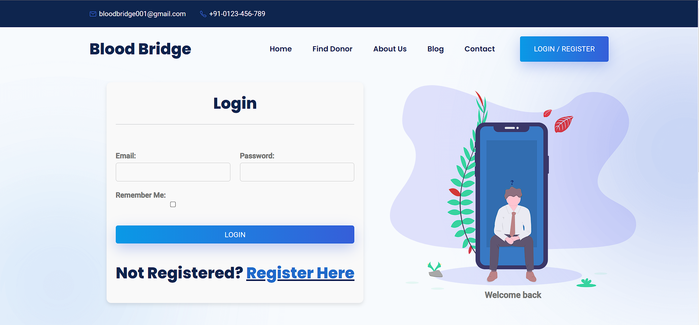

# Blood Bridge

### Video Demo:

### Description:

Blood Bridge is a full stack website project based on online blood donation. This is a responsive and userfriendly website for making the process of blood donation easy.

## Blood Bridge Website Setup Guide

This guide will walk you through the steps to open the Blood Bridge website on your computer or PC. Follow these steps to get your website up and running.

### Prerequisites

Before you begin, ensure you have the following prerequisites installed:

1. Visit the Blood Bridge GitHub repository: [Blood Bridge GitHub Repo](https://github.com/qaidjoharj53/Blood-Bridge).

2. Click on the "Code" button and select "Download ZIP" to download the source code as a ZIP archive.

### Step 1: Download and Install XAMPP

1. Download XAMPP for your operating system (Windows, macOS, or Linux) from the [official website](https://www.apachefriends.org/index.html).

2. Run the installer and follow the on-screen instructions to complete the installation. During installation, you can choose the components you want to install, but the default settings are usually sufficient.

### Step 2: Start XAMPP Control Panel

1. After installation, open XAMPP Control Panel.

    - On Windows, you can find it in the Start menu.
    - On macOS, you can find it in the Applications folder.
    - On Linux, you can start it from the terminal using the `sudo /opt/lampp/manager-linux-x64.run` command.

2. In the XAMPP Control Panel, start the Apache and MySQL services by clicking the "Start" button next to each.

### Step 3: Configure Your Website

1. Place your Blood Bridge website files in the appropriate directory. By default, on Windows, it's in `C:\xampp\htdocs`. On macOS and Linux, it's in `/opt/lampp/htdocs`.

2. Ensure that your main webpage is named `index.php` or `index.html`. This is the page that will be displayed when you access `http://localhost` in your web browser.

### Step 4: Access Your Website

1. Open your web browser (e.g., Chrome, Firefox, or Edge).

2. In the address bar, type `http://localhost` and press Enter. This will load the default webpage, which is your Blood Bridge website.

Congratulations! You've successfully set up and opened your Blood Bridge website on your computer or PC using XAMPP.

## Additional Notes

-   To stop the Apache and MySQL services, go back to the XAMPP Control Panel and click the "Stop" button next to each service.

-   Remember to secure your XAMPP installation and your website before deploying it to a live server.

-   If you encounter any issues, consult the XAMPP documentation or seek assistance from online forums and communities.
