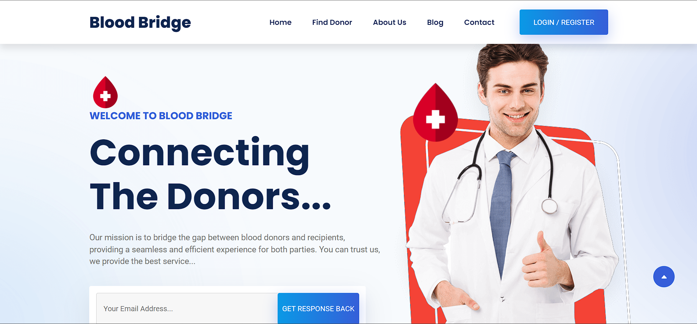

# Blood Bridge: Bridging the Gap for Blood Donation

### 📺 [Check out our Video Demo](https://www.youtube.com/watch?v=3VZnSMy5QFg)

### About Blood Bridge

Blood Bridge is not just a website; it's a lifeline for those in need. Our full-stack website project simplifies the process of blood donation, making it accessible to everyone. With its responsive design and user-friendly interface, Blood Bridge empowers donors and recipients alike.

# Blood Bridge Setup Guide

Ready to set up Blood Bridge on your computer? Follow these steps to get it up and running smoothly.
You can set it up using locally, or using Docker.

## XAMPP

### Prerequisites

Before you begin, make sure you have the following prerequisites:

1. Head over to the [Blood Bridge GitHub repository](https://github.com/qaidjoharj53/Blood-Bridge).

2. Click on the "Code" button and select "Download ZIP" to get the source code as a ZIP archive.

### Step 1: Download and Install XAMPP

1. Download XAMPP for your operating system (Windows, macOS, or Linux) from the [official website](https://www.apachefriends.org/index.html).

2. Run the installer and follow the on-screen instructions. The default settings should suffice, but feel free to customize as needed.

### Step 2: Start XAMPP Control Panel

1. After installation, launch the XAMPP Control Panel.

   - On Windows, find it in the Start menu.
   - On macOS, locate it in the Applications folder.
   - On Linux, use the `sudo /opt/lampp/manager-linux-x64.run` command in your terminal.

2. In the XAMPP Control Panel, initiate the Apache and MySQL services by clicking "Start" for each.

### Step 3: Configure Your Website

1. Place your files from the `code`-folder in the appropriate directory. On Windows, it's `C:\xampp\htdocs` by default. On macOS and Linux, you'll find it at `/opt/lampp/htdocs`.

2. Ensure that your main webpage is named either `index.php` or `index.html` and is inside the `htdocs` folder. This will be the page displayed when you visit `http://localhost` in your web browser.

### Step 4: Access Your Website

1. Open your preferred web browser (e.g., Chrome, Firefox, or Edge).

2. Type `http://localhost` into the address bar and hit Enter. This will load your Blood Bridge website, the default webpage.

Congratulations! You've successfully set up and opened Blood Bridge on your computer or PC using XAMPP.

## Docker
The modern alternative is using Docker. You'll only need [docker](https://docs.docker.com/engine/install/) and docker-compose. 

You'll only need to run the `docker compose up -d` command from your terminal to run the website.
It will be accessible under http://localhost afterwards.
You can stop the containers again using `docker compose down --remove-orphans`

## Badges of Honor

## Additional Notes

- Don't forget to stop the Apache and MySQL services. Simply return to the XAMPP Control Panel and click "Stop" for each service.

- Ensure the security of your XAMPP installation and website before deploying them to a live server.

- If you encounter any issues, consult the XAMPP documentation or seek assistance from online forums and communities.
